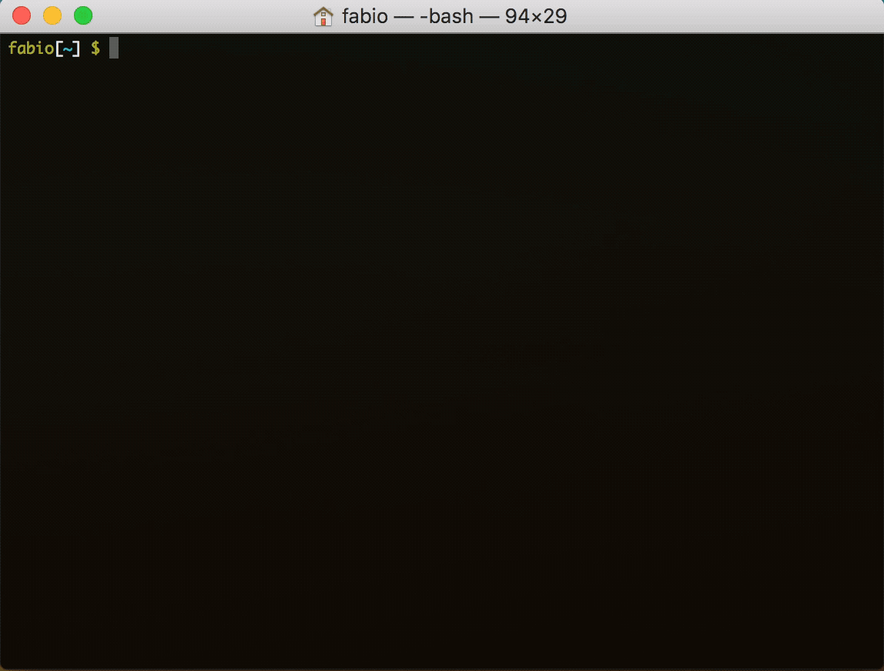

# Watch

Watch anything instantaneously, just write its name.

It searches a magnet for you and streams it using [WebTorrent](https://github.com/fabiospampinato/webtorrent-cli/tree/iina-support) to your favorite app.

## Install

```shell
$ npm install -g @fabiospampinato/watch
```

## Usage

#### Wizard

Execute `watch` to run a wizard, it'll ask you everything it needs: a search query, which title to stream, and which app to use.

<p align="center">
	
</p>

#### I'm Feeling Lucky

If you're feeling lucky, just run something like this to automatically pick the first result:

```shell
watch Star Wreck
```

#### Manual

You can also directly pass any of the valid torrent identifiers supported by [parse-torrent](https://github.com/webtorrent/parse-torrent) to stream it:

```shell
watch "magnet:?xt=urn:btih:a2c1adc668fc25bdcb137d43060b76cd043a7fdb&dn=Tears+of+Steel+%282012%29+1080p+mkv&tr=udp%3A%2F%2Ftracker.leechers-paradise.org%3A6969&tr=udp%3A%2F%2Fzer0day.ch%3A1337&tr=udp%3A%2F%2Fopen.demonii.com%3A1337&tr=udp%3A%2F%2Ftracker.coppersurfer.tk%3A6969&tr=udp%3A%2F%2Fexodus.desync.com%3A6969"
```

#### WebTorrent Options

You can pass arbitrary options to [WebTorrent](https://github.com/fabiospampinato/webtorrent-cli/tree/iina-support), read more about them [here](https://github.com/fabiospampinato/webtorrent-cli/tree/iina-support). Just write them after the special `--` argument:

```shell
watch -- --vlc --port 1234
watch Star Wreck -- --vlc --port 1234
```

## License

MIT © Fabio Spampinato
